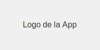
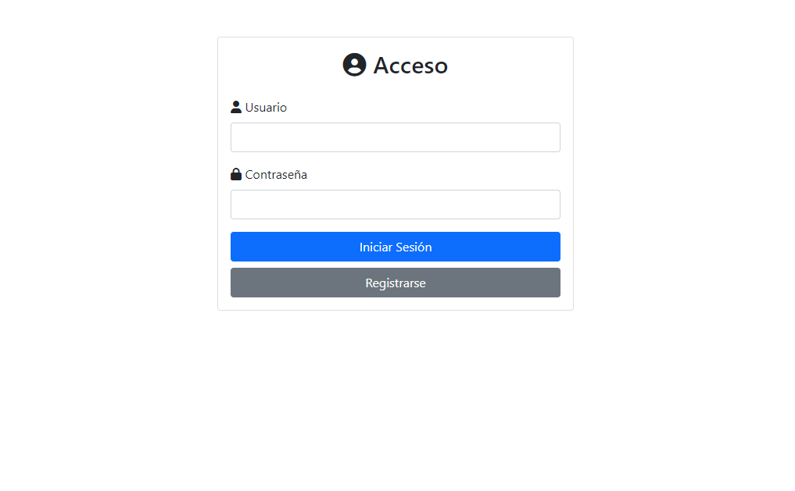
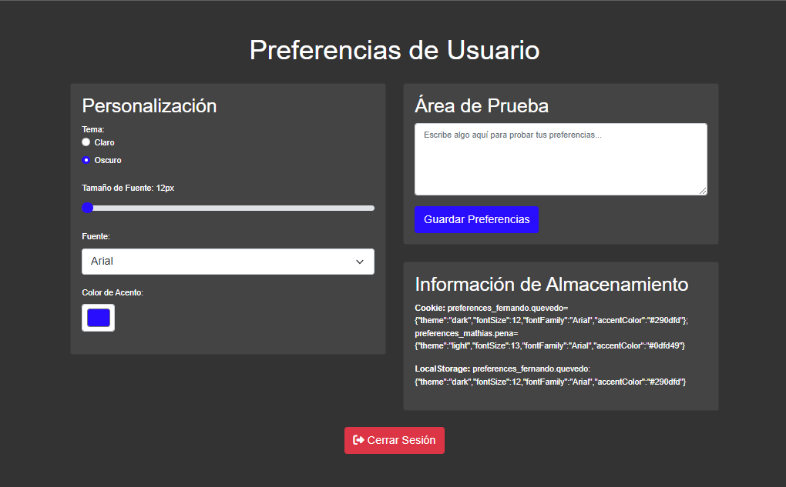

# Mini Aplicación de Preferencias de Usuario

Esta es una pequeña aplicación web que demuestra la gestión de preferencias de usuario, incluyendo autenticación básica y personalización de la interfaz.

## Características

- Registro de usuarios e inicio de sesión
- Validación de contraseñas para garantizar seguridad básica
- Personalización de preferencias de usuario:
  - Tema (claro/oscuro)
  - Tamaño de fuente
  - Familia de fuente
  - Color de acento
- Almacenamiento local de preferencias de usuario
- Interfaz de usuario mejorada con SweetAlert2 para notificaciones

## Capturas de pantalla

### Página de inicio de sesión

### Página de preferencias

## Tecnologías utilizadas

- HTML5
- CSS3
- JavaScript (ES6+)
- Bootstrap 5
- Font Awesome
- SweetAlert2

## Instalación

1. Clona este repositorio o descarga los archivos.
2. No se requiere instalación adicional, ya que la aplicación utiliza CDNs para las dependencias externas.

## Uso

1. Abre el archivo `index.html` en tu navegador web.
2. Regístrate con un nuevo usuario o inicia sesión si ya tienes una cuenta.
3. Una vez iniciada la sesión, serás redirigido a la página de preferencias.
4. Personaliza tus preferencias y guárdalas.
5. Puedes cerrar sesión utilizando el botón correspondiente.

## Estructura del proyecto

- `index.html`: Página de inicio de sesión y registro
- `preferences.html`: Página de preferencias de usuario
- `script.js`: Lógica para el manejo de usuarios y autenticación
- `preferences.js`: Lógica para la gestión de preferencias de usuario
- `styles.css`: Estilos personalizados
- `images/`: Directorio con imágenes del proyecto y capturas de pantalla

## Seguridad

Nota: Esta aplicación es solo para fines demostrativos y educativos. En un entorno de producción, se deben implementar medidas de seguridad adicionales, como el hash de contraseñas y la validación en el lado del servidor.

## Contribuciones

Las contribuciones son bienvenidas. Por favor, abre un issue para discutir cambios mayores antes de crear un pull request.

## Licencia

[MIT](https://choosealicense.com/licenses/mit/)
Last edited hace 3 minutos

